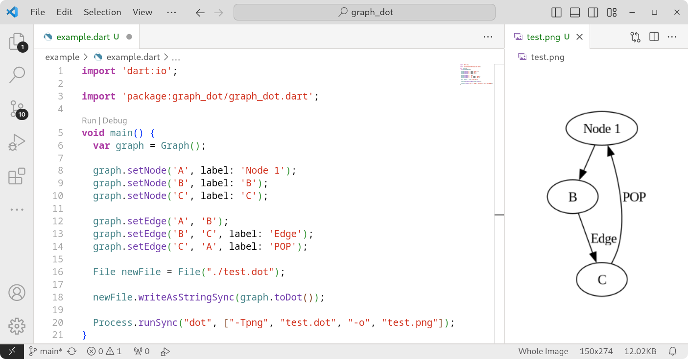

Library for creating Graphviz graphs in the dot language.



## Getting started

Add a dependency to `pubspec.yaml`

```yaml
dependencies:
    graph_dot:
```

## Usage

Look in `/example` folder.

```dart
var graph = Graph();

graph.setEdge('A', 'B');

print(graph.toDot);
```

## Additional information

This library is under development. With each new version, a new feature will be added.
